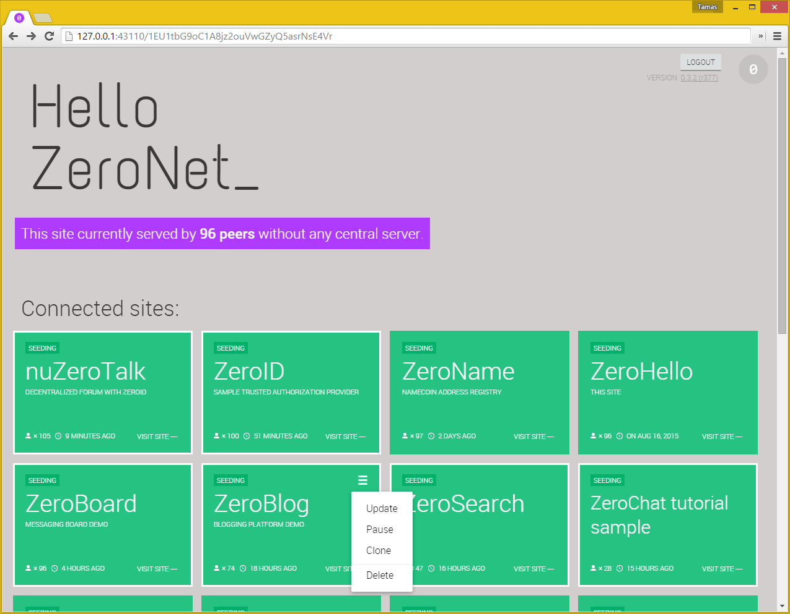

# 什么是 ZeroNet ？

ZeroNet 使用比特币加密技术和 BitTorrent 技术来创建一个**分布式的抗审查网络**.

用户能在 ZeroNet 上发布一个静态的或动态的网站 and visitors can choose to also serve the website. Websites will remain online even if it is being served by only one peer.

当一个网站被所有者更新时，all nodes serving that site (previous visitors) will receive only the incremental updates done to the site content.

ZeroNet 内置一个 SQL 数据库。这使得以内容为重的网站的开发变得容易。该数据库也与托管的节点以增量更新的形式同步。

# 为什么？

* 我们相信开放、自由、未经审查的沟通。
* 没有审查：一旦被出版就没有办法被移除
* 没有单点故障：即使只有一个节点正在服务内容，仍然在线。
* 不可能被关闭：它不在是因为它无处不在，内容由任何想要它的用户提供服务。
* 快速：ZeroNet 使用 BitTorrent 技术比中心化服务器更快地提供内容。
* 离线使用：在你的网络不可用时，你依然可以访问你的网站。
* 安全： Content ownership is secured using the same cryptography that secures your Bitcoin wallet.

[comment]: <> (I'm unsure about the following bit. Thoughts?)
[comment]: <> (# What problem is ZeroNet solving?)

[comment]: <> (When Tim Berners-Lee created the internet, he meant for it to be free. Not surveilled nor censored. And [he is still fighting for that](http://edition.cnn.com/2014/03/12/tech/web/tim-berners-lee-web-freedom/).)

[comment]: <> (The internet is centralized mainly in two places: Content and Domain Names (URLs) are hosted and controlled by central servers. If you control the central servers (and if you are powerful enough you do) you control the network.)

[comment]: <> (**Decentralized content storage**)

[comment]: <> (ZeroNet tackles the content storage problem by giving everyone the ability to store content. Site visitors can choose to store a website on their computers, and when they do this they also help to serve the site to other users. The site is online even if only one user is hosting it.)

[comment]: <> (**Shared DNS cache**)

[comment]: <> (Site addresses on ZeroNet are cached by all network members. When you type a ZeroNet site URL on your browser this will query other peers connected to you about the site. If one of these peers happen to have the site they will send it to you, if not, they will forward your query along.)

[comment]: <> (This architecture means that when a site URL is created, as long as one peer is serving it, there is no way to take the URL down.)

# 特性
 * 简单，零配置安装。
 * 无密码 [BIP32](https://github.com/bitcoin/bips/blob/master/bip-0032.mediawiki)
   基于授权：你的帐户由你的比特币钱包相同的密码来保护。
 * 实时站点更新。
 * 域名币 .bit 域名支持。
 * SQL 数据库支持：允许更简单地开放网站和更快地载入页面。
 * 自动：完全支持使用 .onion 隐藏服务的 Tor 网络而不是 IPv4 地址。
 * TLS 加密连接。
 * 自动，uPnP 端口开启。
 * 用于多用户（开放代理）支持的插件。
 * 工作在任何浏览器/操作系统

# 它是如何工作的？

* After you install and run ZeroNet, you open a site by visiting:
  `http://127.0.0.1:43110/{zeronet_site_address}`
  (eg.  `http://127.0.0.1:43110/1HeLLo4uzjaLetFx6NH3PMwFP3qbRbTf3D`).
* ZeroNet will then use the BitTorrent network to find peers that are seeding the site and will download the site content (HTML, CSS, JS...) from these peers.
* Each visited site becomes also served by you.
* Every site contains a list of all files used in the site in a SHA512 hash and a signature generated using the site owner private key.
* If the site owner modifies the site, then he/she signs a new list and publishes it to the peers.
  After the peers have verified the files list integrity (using the
  signature), they download the modified files and publish the new content to
  other peers.

##### [Slideshow about ZeroNet cryptography, content updates, multi-user sites &raquo;](https://docs.google.com/presentation/d/1_2qK1IuOKJ51pgBvllZ9Yu7Au2l551t3XBgyTSvilew/pub?start=false&loop=false&delayms=3000)

# 截图

##### [更多截图 &raquo;](/using_zeronet/sample_sites/)

# 目前的限制

* 没有类似于 torrent 的大型文件的文件分割支持。
* 传输的文件没有被压缩 ~~或者被加密~~ (TLS 加密已加入)
* 没有私人网站

# 帮助这个项目存活

Bitcoin: 1QDhxQ6PraUZa21ET5fYUCPgdrwBomnFgX

### 谢谢你！

* 更多信息、帮助、更改日志、Zeronet 网站：[http://www.reddit.com/r/zeronet/](http://www.reddit.com/r/zeronet/)
* 来和我们聊天：[#zeronet @ FreeNode](https://kiwiirc.com/client/irc.freenode.net/zeronet) or on [gitter](https://gitter.im/HelloZeroNet/ZeroNet)
